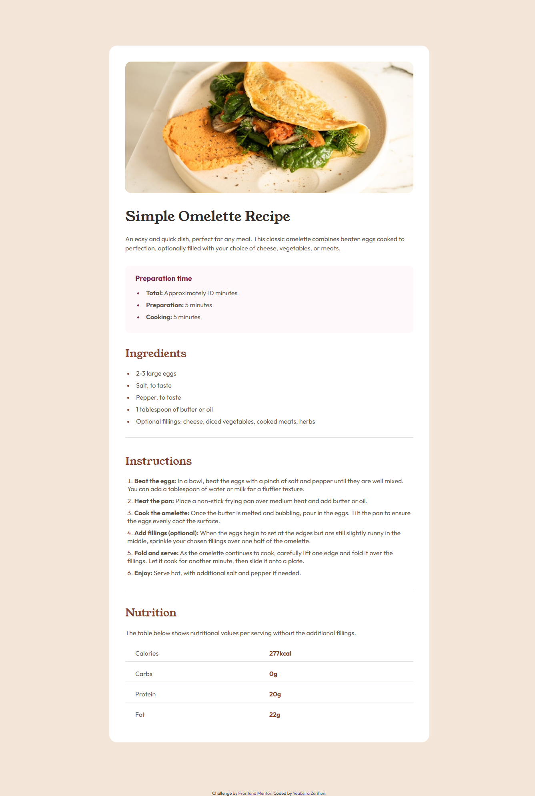

# Frontend Mentor - Recipe page solution

This is a solution to the [Recipe page challenge on Frontend Mentor](https://www.frontendmentor.io/challenges/recipe-page-KiTsR8QQKm).

## Table of contents

- [Overview](#overview)
  - [The challenge](#the-challenge)
  - [Screenshot](#screenshot)
  - [Links](#links)
- [My process](#my-process)
  - [Built with](#built-with)
  - [What I learned](#what-i-learned)
  - [Useful resources](#useful-resources)
- [Author](#author)

## Overview

### The challenge

The challenge is to build out this recipe page and get it looking as close to the design as possible.

### Screenshot



### Links

- Solution URL: [https://github.com/DevAbilak/recipe-page-solution](https://github.com/DevAbilak/recipe-page-solution)
- Live Site URL: [https://devabilak.github.io/recipe-page-solution/](https://devabilak.github.io/recipe-page-solution/)

## My process

### Built with

- Semantic HTML5 markup
- Flexbox
- CSS Grid

### What I learned

I learned to style the color of ordered and unordered list styles such as bullets and numbers.

```css
li::marker {
  color: hsl(14, 45%, 36%);
}
```

### Useful resources

- [https://www.w3schools.com/howto/howto_css_bullet_color.asp](https://www.w3schools.com/howto/howto_css_bullet_color.asp) - This is an amazing article which helped me finally understand how to chane the color of list style such as bullet and number. I'd recommend it to anyone still learning this concept.

## Author

- Frontend Mentor - [@DevAbilak](https://www.frontendmentor.io/profile/DevAbilak)
